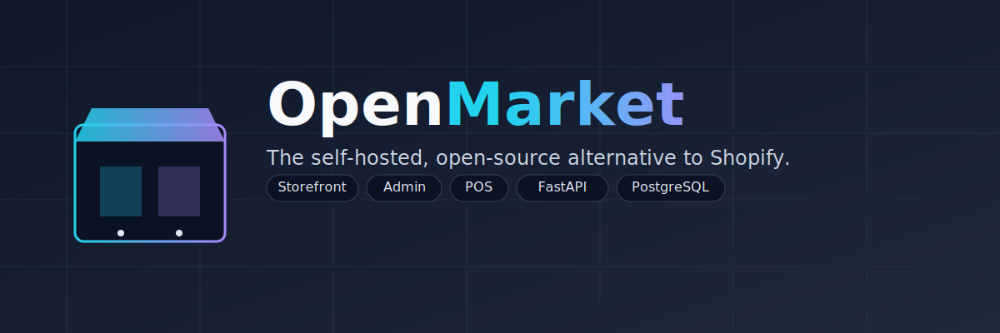

<p align="center">
  
</p>

# OpenMarket

The self-hosted, open-source alternative to Shopify. One stack, three surfaces: **Storefront**, **Admin**, and **POS**.

## Features

- **Catalog** — products, variants, collections, inventory
- **Selling** — orders, fulfillments, returns, discounts
- **Customers** — accounts, sessions, MFA, role-based users
- **Operations** — tax & shipping rules, analytics, audit logs
- **Realtime** — WebSocket updates across admin and POS
- **Stack** — FastAPI, PostgreSQL, SQLAlchemy, React (Vite), nginx

## Quickstart

```bash
cp .env.example .env        # fill in secrets (openssl rand -hex 32)
docker compose up -d --build
```

- Storefront: <http://localhost/>
- Admin: <http://localhost/admin>
- POS: <http://localhost/pos>
- API: <http://localhost:8000/api/health>

First-run bootstrap creates the owner account via `/auth/setup`; see [`docs/ops/bootstrap-first-run.md`](docs/ops/bootstrap-first-run.md).

## Development

```bash
# Backend
cd backend && pip install -r requirements.txt && uvicorn app.main:app --reload

# Frontend (pnpm workspace)
cd frontend && pnpm install
pnpm dev:store    # or dev:admin / dev:pos
```

Run tests with `pytest` from `backend/`.

## Layout

```
backend/            FastAPI app, Alembic migrations, tests
frontend/packages/  store · admin · pos · shared
docs/ops/           runbooks (TLS on LAN, first-run bootstrap)
```
